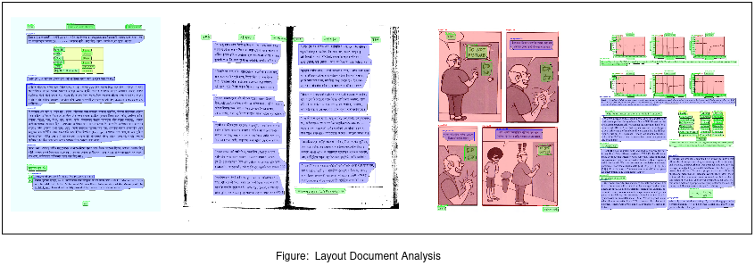

# BN-LDA-YOLO8


Bangla Layout Document Analysis Model[Yolov8], This repo show that YOLOv8 customizable ultralytics module for custom data training and build a YOLOv8 demo from scratch using the custom-generated Bangla Layout Document Analysis Dataset. the 4 classes of the dataset that are "text_box", "table", "paragraph", image etc.
So Here we train the detection model using the dlsprint2 dataset and try to leverage high performance for detection of the of Bangla Layout Document. Here we use around 20223 data for building this model.

## Installation
Tested with: Python 3.8 Pytorch 1.12.0+cu113
```
Pip install -r requirements.txt
```

## Dataset

The dataset for this competition comprises about 34,000 Bengali documents annotated using polygon boundaries and rectangular bounding boxes. These documents range from newspaper articles, official documents, notices, and government gadgets to novels, comics, magazines, and even liberation war records.

Paper Link [Click](https://arxiv.org/abs/2303.05325)

## Data Processing

Please check the data processing repo [click](https://github.com/ultralytics/JSON2YOLO) script is ```general_json2yolo.py```

Traning Data structure,
```sh
dataset
├── annotations
│   ├── training.json
│   └── valivation.json
├── images
│   ├── training
│   │    ├── 01.jpg
│   │    └── 02.jpg
│   └── valivation
│   │   ├── 03.jpg
│   │   └── 04.jpg
├── labels
│   ├── training
│   │   ├── 01.txt
│   │   └── 02.txt
│   └── valivation
│   │   ├── 03.jpg
│   │   └── 04.jpg
├── training.txt
│    ├──./images/training/01.jpg
│    └──./images/training/02.jpg
└── validation.txt
    ├──./images/valivation/03.jpg
    └──./images/valivation/04.jpg
```

## Label should be below this type of format,

Example: 01.txt
```
if the coordiante like this : [x-min, y-min, x-max, y-max] or [x1, y1, x2, y2]
or
[x1, y1, x2, y2, x3, y3, x4, y4....xn, yn]


# normalize x by width[image width]
# normalize y by height[image height]
```
```
class_index Norimalize of [x1,y1, x2, y2] 
      7     0.799583 0.424375 0.0975 0.13875

```
## Traning Configuration

Check Config file into ```data``` folder,

```
path: /media/sayan/hdd1/CV/yolov8_training/dataset # dataset root dir
train: images/training  # train images (relative to 'path') 128 images
val: images/validation  # val images (relative to 'path') 128 images
test:  images/validation

nc: 4

# Classes
names:
  0: paragraph
  1: text_box
  2: image
  3: table

```


## Training

Check the internal configuration of ```train.py``` script and run ```train.py```

## Inference

Make sure the model and data path and run ```inference.py```

## Testing
```
sementics segmentation mAP: 0.88356
```
## Reference

1. https://docs.ultralytics.com
2. https://www.kaggle.com/competitions/dlsprint2?rvi=1
